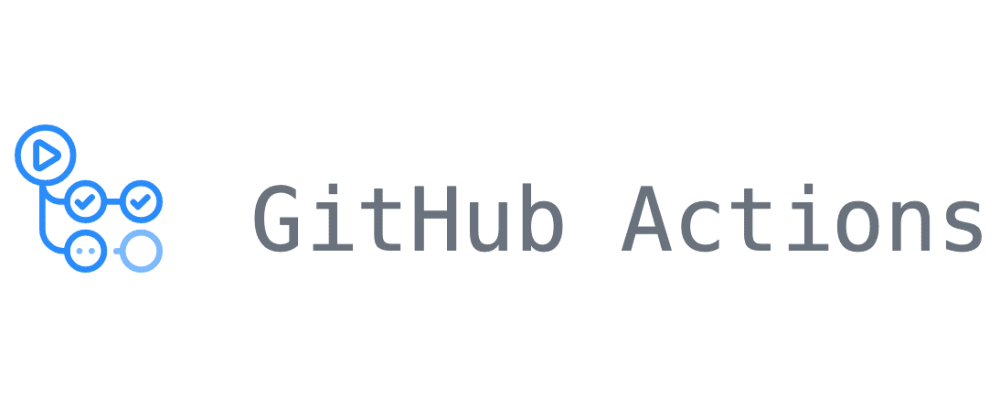

# Exemplos de Configuração do GitHub Actions

Esse projeto centraliza alguns exemplos de pipelines do GitHub Actions. Foi criado para servir como base de conhecimento e facilitar a criação de novas pipelines CI em outros projetos.

Vale destacar que as versões das actions utilizadas são constantemente atualizadas, portanto é importante verificar por novas versões sempre que for utilizar algum desses exemplos.

## Exemplos

### Java

[Nesse exemplo](./java/java-ci.yaml) foi desenvolvido uma pipeline CI para um projeto em Java + Maven. Além disso, foi adicionado a configuração para fazer o build e publicar a imagem docker do projeto.

#

### Node

**Backend**

[Nesse exemplo](./node/backend-nodejs-ci.yaml) a pipeline é mais simples, tem a função de instalar as dependências, rodar os testes e verificar erros do eslint. Foi Utilizado a versão 16 do Node.

**Frontend**

[Nesse exemplo](./node/frontend-react-ci.yaml) a pipeline é de um projeto feito com React. Na configuração está considerando que o projeto do frontend esteja dentro de uma pasta raiz, portanto, como o workflow deve ficar na pasta raiz, em todos os comandos é acessado a pasta frontend com `cd frontend`. É apenas uma forma diferente de fazer, essa parte pode ser removida conforme necessário.

#

### Docker

[Nesse exemplo](./docker/docker-ci.yaml) a configuração é para fazer o build e publicar imagem no dockerhub. É importante destacar que essa configuração pode ser utilizada para projetos de qualquer linguagem, desde que o projeto tenha o Dockerfile pronto. Para essa configuração funcionar é necessário ter uma conta no DockerHub e configurar usuário e senha dessa conta com secret (variáveis de ambiente) no repositório do projeto GitHub. Para salvar os secrets siga o passo a passo da [documentação oficial](https://docs.github.com/en/actions/security-guides/using-secrets-in-github-actions)
